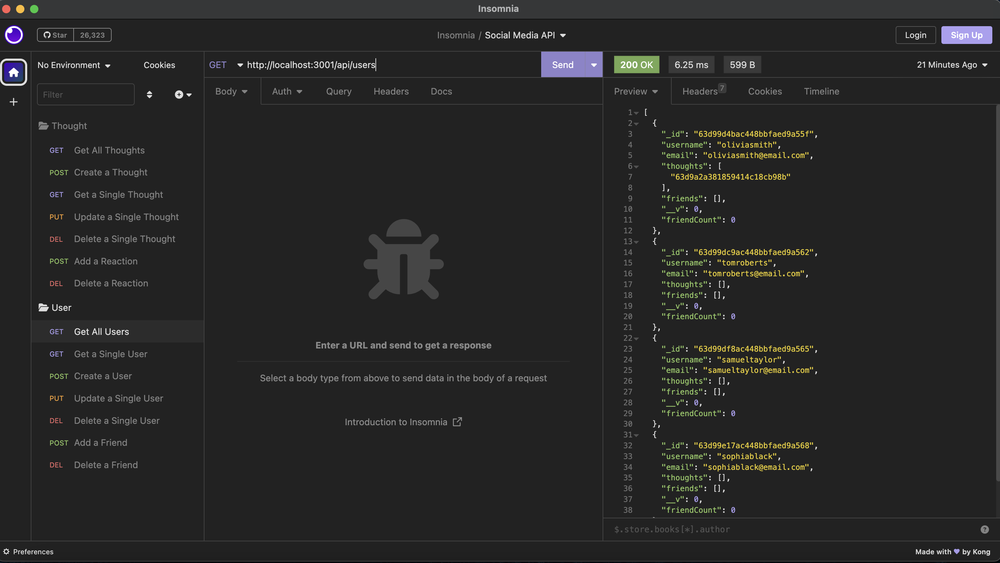

# Social Network API

[Link to Walk-through Video](https://drive.google.com/file/d/1qAAyplpKWNtzHNaqKRKqsUNZBxbCLGaR/view)

## Table of Contents
- [Description](#description)
- [Usage](#usage)
- [Visuals](#visuals)

## Description

This is an API for a social network's web application where users can create accounts, share their thoughts, react to friends' thoughts, and add to or delete from a friends list. This API utilizes Express.js for routing, a MongoDB database, and the Mongoose ODM. Please watch the walk-through video to see how it works!

## Usage

To run this application, please follow the instructions below:

While in the terminal or bash, run the following command:
```js
npm install
```
This will install the necessary packages for this application to run.

Once the packages are installed, you can then run the next command:
```js
nodemon
```
This command will start the server. You should see a message appear in the terminal or bash that looks like this:


Once the server is running, open the Insomnia app to test the routes.

## Visuals

